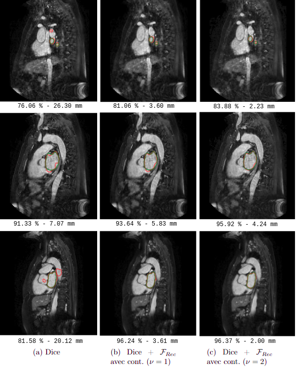
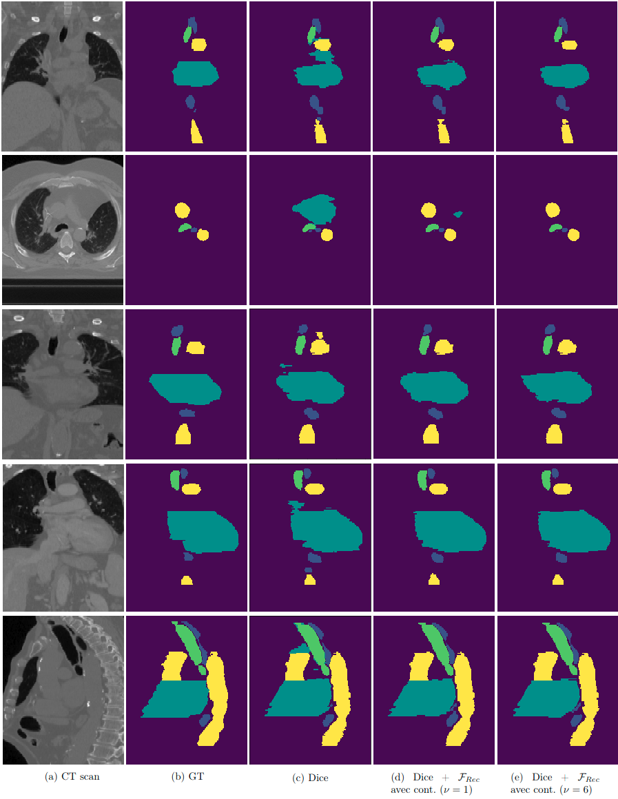

# Topological Constrained Neural Network

Author : [Zoé Lambert](https://zoe-lambert.fr/)

This repository contains the implementation developed to reproduce the results presented in the following article.

## [On the Inclusion of Topological Requirements in CNNs for Semantic Segmentation Applied to Radiotherapy](https://link.springer.com/chapter/10.1007/978-3-031-31975-4_28)

### Abstract

The incorporation of prior knowledge into a medical segmentation task allows to compensate for the issue of weak boundary definition and to be more in line with anatomical reality even though the data do not explicitly show these characteristics. This motivation underlies the proposed contribution which aims to provide a unified variational framework involving topological requirements in the training of convolutional neural networks through the design of a suitable penalty in the loss function. More precisely, these topological constraints are implicitly enforced by viewing the segmentation assignment as a registration task between the considered image and its associated ground truth under incompressibility condition, making them homeomorphic. The application falls within the scope of organ-at-risk segmentation in CT (Computed Tomography) images, in the context of radiotherapy planning.


## Results




## How to Use

After cloning the project, follow these steps:

1. Create a virtual environment and install the necessary libraries:
    ```bash
    make venv
    ```

2. Navigate to the file `src/topological_constrained/conf/conf_file.py` and modify the desired parameters, particularly:
   - `data_dir`: the path to the folder containing the training and validation subfolders.
   - `train_dir`: the name of the folder containing the training data.
   - `validation_dir`: the name of the folder containing the validation data.
   - `checkpoint_dir`: the name of the folder containing the trained model checkpoints.
   - `interpolation_so_file`: the path of the interpolation c file.

3. Start the training 
    ```bash
    make train
    ```
